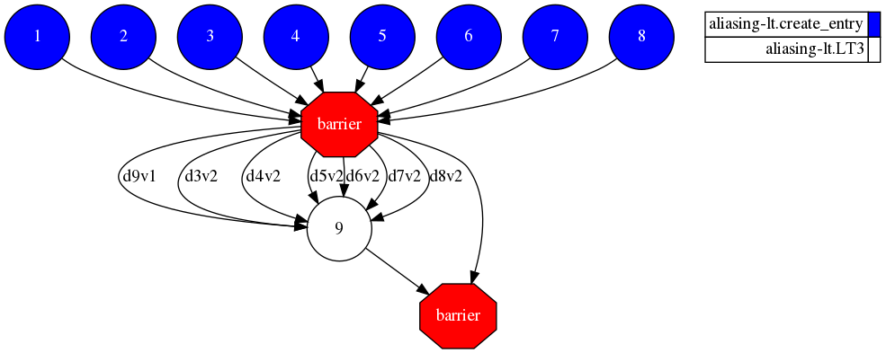
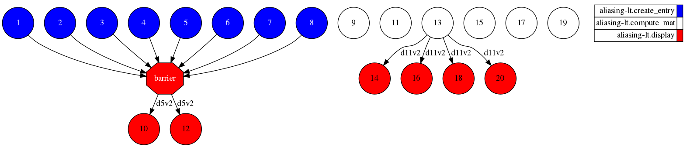

# ALIASING - LOOP TASK

## Description

Application with testing purposes for Aliasing on LoopTasking procedure

## Task Graph comparison

### Auto Parallel Task Graph

### User Parallel Task Graph

[wikipedia-fdtd]: https://en.wikipedia.org/wiki/Finite-difference_time-domain_method
