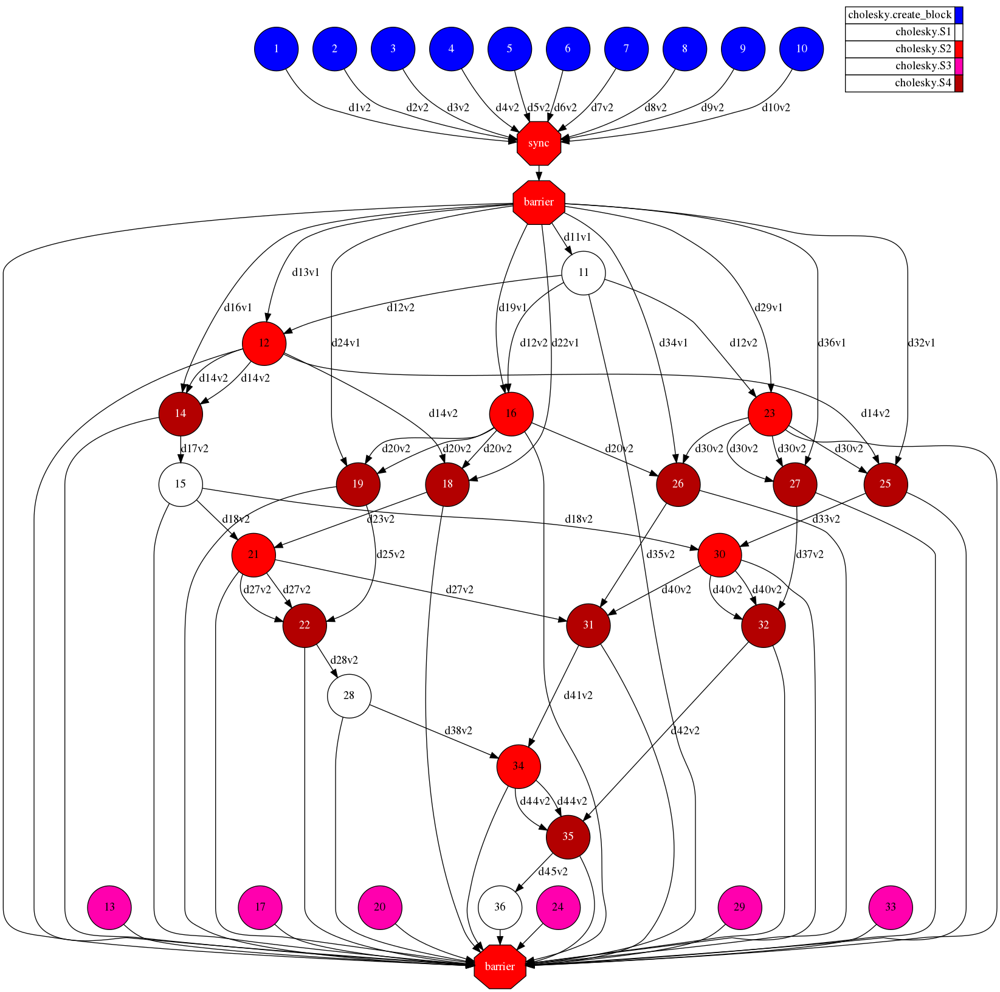
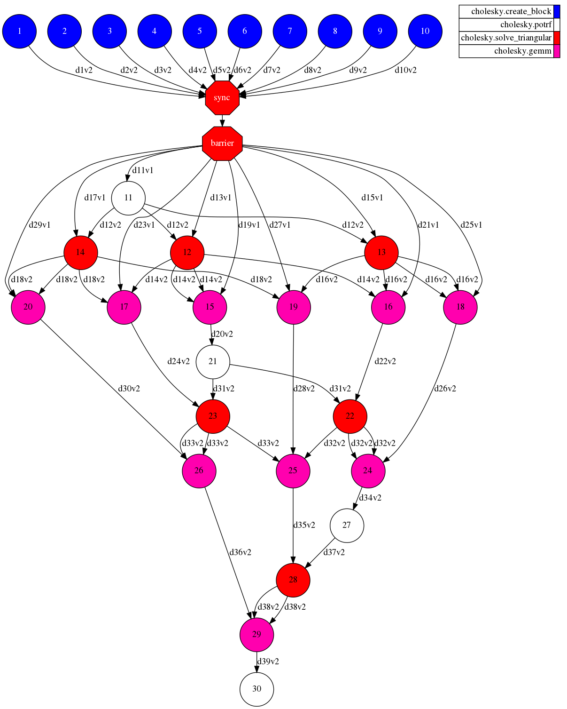

# Cholesky

## Description

"In linear algebra, the Cholesky decomposition or Cholesky factorization is a 
decomposition of a Hermitian, positive-definite matrix into the product of a
lower triangular matrix and its conjugate transpose, which is useful for 
efficient numerical solutions, e.g. Monte Carlo simulations." 
([Wikipedia][wikipedia-cholesky])

## Task Graph comparison

### Auto Parallel Task Graph

### User Parallel Task Graph

[wikipedia-cholesky]: https://en.wikipedia.org/wiki/Cholesky_decomposition
