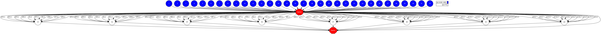
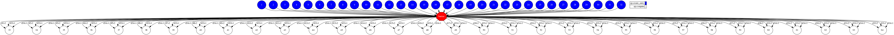

# Embarrassingly parallel

## Description

"In parallel computing, an embarrassingly parallel workload or problem (also called
perfectly parallel or pleasingly parallel) is one where little or no effort is needed
to separate the problem into a number of parallel tasks. This is often the case
where there is little or no dependency or need for communication between those
parallel tasks, or for results between them."
([Wikipedia][wikipedia-ep])

## Task Graph comparison

### Auto Parallel Task Graph

### User Parallel Task Graph

[wikipedia-ep]: https://en.wikipedia.org/wiki/Embarrassingly_parallel