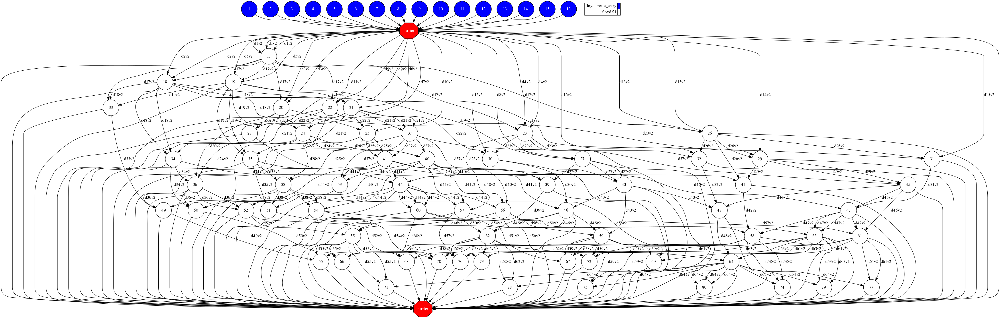
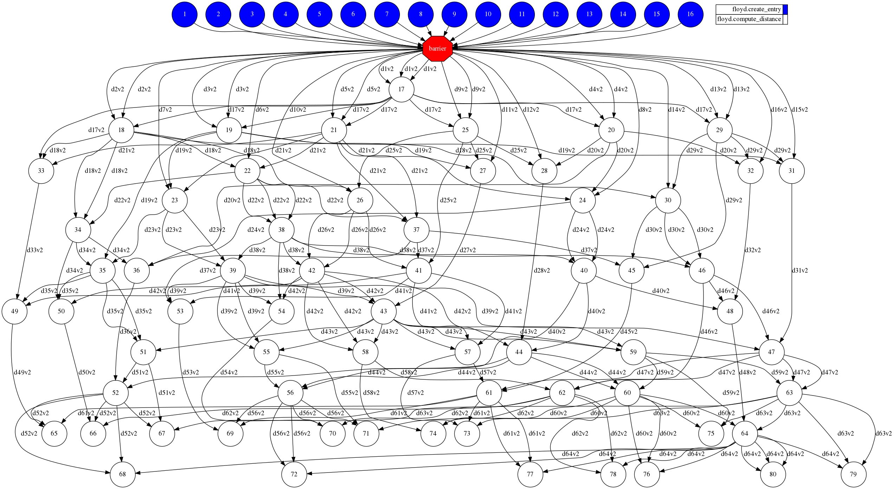

# Floyd

## Description

"In computer science, the Floyd–Warshall algorithm is an algorithm for finding
shortest paths in a weighted graph with positive or negative edge weights (but with
no negative cycles). A single execution of the algorithm will find the lengths
(summed weights) of the shortest paths between all pairs of vertices. Although
it does not return details of the paths themselves, it is possible to reconstruct
the paths with simple modifications to the algorithm." 
([Wikipedia][wikipedia-floyd])

## Task Graph comparison

### Auto Parallel Task Graph

### User Parallel Task Graph

[wikipedia-floyd]: https://en.wikipedia.org/wiki/Floyd%E2%80%93Warshall_algorithm