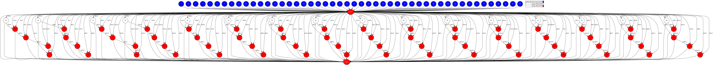
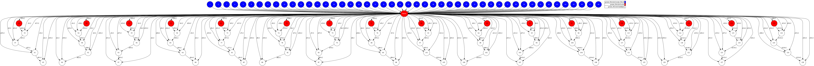

# GEMM BLOCKED

## Description

"In mathematics, matrix multiplication or matrix product is a binary operation that
produces a matrix from two matrices with entries in a field, or, more generally, in a
ring. The matrix product is designed for representing the composition of linear maps
that are represented by matrices. Matrix multiplication is thus a basic tool of linear
algebra, and as such has numerous applications in many areas of mathematics, as well
as in applied mathematics, physics, and engineering" 
([Wikipedia][wikipedia-matmul])

## Task Graph comparison

### Auto Parallel Task Graph

### User Parallel Task Graph

[wikipedia-matmul]: https://en.wikipedia.org/wiki/Matrix_multiplication
