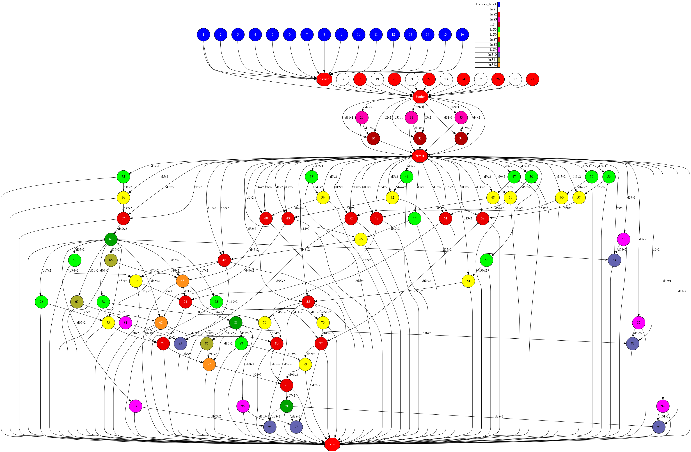
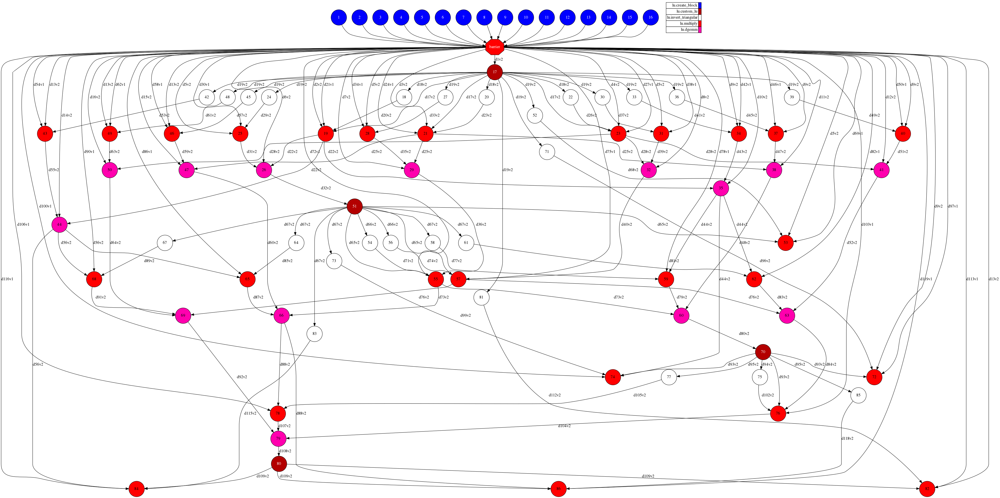

# LU

## Description

"In numerical analysis and linear algebra, LU decomposition (where 'LU' stands for
'lower upper', and also called LU factorization) factors a matrix as the product of
a lower triangular matrix and an upper triangular matrix. The product sometimes
includes a permutation matrix as well. The LU decomposition can be viewed as the
matrix form of Gaussian elimination. Computers usually solve square systems of linear
equations using the LU decomposition, and it is also a key step when inverting a
matrix, or computing the determinant of a matrix. The LU decomposition was introduced
by mathematician Tadeusz Banachiewicz in 1938." 
([Wikipedia][wikipedia-lu])

## Task Graph comparison

### Auto Parallel Task Graph

### User Parallel Task Graph

[wikipedia-lu]: https://en.wikipedia.org/wiki/LU_decomposition