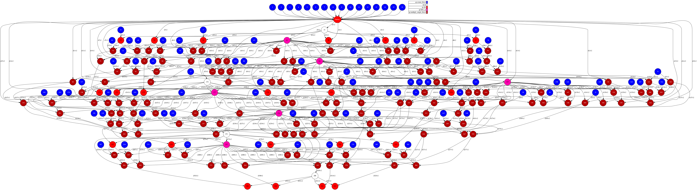

# QR

## Description

"In linear algebra, a QR decomposition (also called a QR factorization) of a matrix
is a decomposition of a matrix A into a product A = QR of an orthogonal matrix Q and
an upper triangular matrix R. QR decomposition is often used to solve the linear least
squares problem, and is the basis for a particular eigenvalue algorithm, the QR
algorithm." 
([Wikipedia][wikipedia-qr])

## Task Graph comparison

### Auto Parallel Task Graph

### User Parallel Task Graph

[wikipedia-qr]: https://en.wikipedia.org/wiki/QR_decomposition